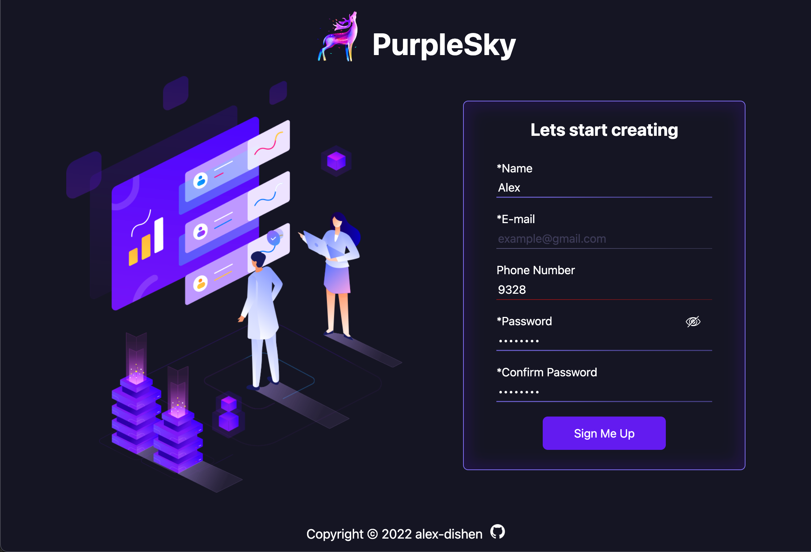

# Sign-up Form
The **Sign-up Form** is created according to the assignment from **The Odin Project** [course](https://www.theodinproject.com/paths/full-stack-javascript/courses/intermediate-html-and-css).
 
 

### 🔗 **Live preview** of the project is [here](https://alex-dishen.github.io/sign-up-form/).

## **Features**
* Ability to see the password

## **Outcome**
* Used **HTML**
* Used **CSS**
* Used **JavaScript**
* Learned how to use Forms and there validation
* Improved skill for building responsive designs
* Usage of normalize.css file

## **Navigation**
* See my next [Project](https://github.com/alex-dishen/admin-dashboard)
* See my previous [Project](https://github.com/alex-dishen/calculator)